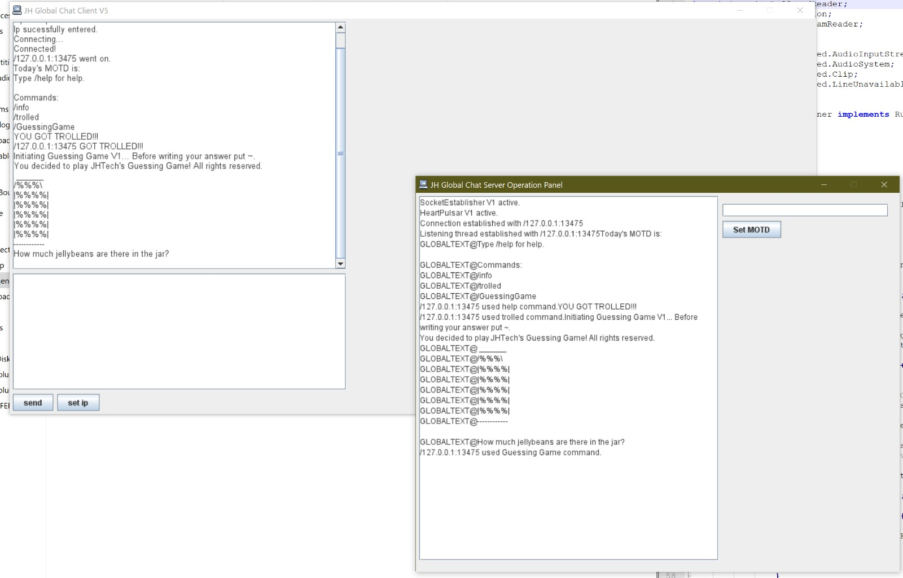
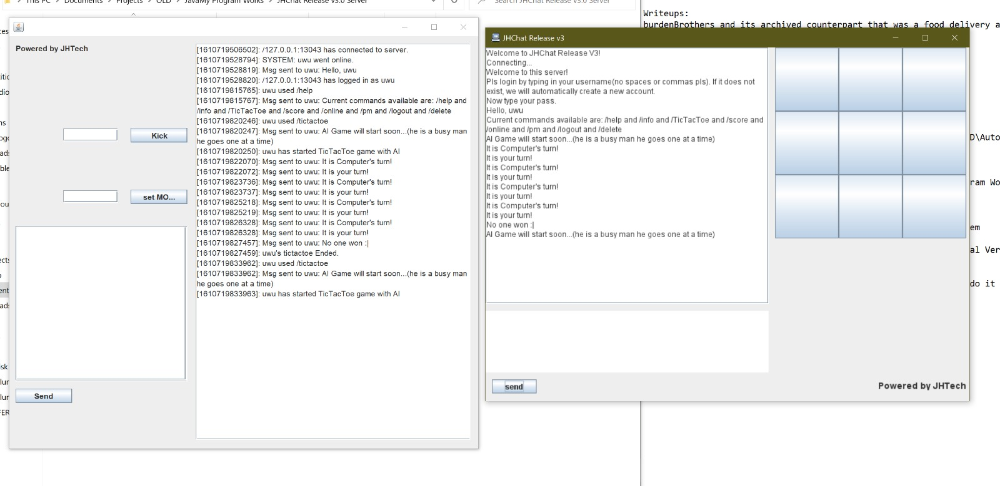

# JHChat

The passion project of a immature primary school kid. I have decided to upload it for preservation. In the future, I might write a blog post or make a video attempting to thoroughly dissect yet appreciate this hot mess.

## History

- Private_Chat_Machine/Server - June 2013
  - Server had GUI but client didn't.
  - Works using pure miracles.
- JHGlobal - November 2013
  - JHServer is actually empty; it works using the previous version's server.
  - Pretends to be fancy but a lot of it is client side. At least has a GUI.
- Global Chat Server/Client - December 2013
  - Complete rewrite; actually started splitting classes and organizing for once.
  - Main feature is a guessing game with an ascii bean jar `/guessingGame`.
  - Is labelled V5, indicating 4 versions lost to beginner me who couldn't source control yet.
- JHChat Release/Server - July 2014
  - Another complete rewrite. Organization only improved slightly but is more object-oriented at least.
  - Source control is literally copy-pasting the directory and renaming it.
  - I probably made this by stealing code from a side project where I made tictactoe.
  - Has multiplayer invite-based tictactoe and even a tictactoe AI.
    - I have absolutely no idea how the tictactoe AI works, looks like a bunch of if-else and switches but it can draw 99% of the time.
  - Hm, I wonder if there was ever a follow up... oh.
    - <https://github.com/Interpause/metaTTT_App>
  - Seriously, I had forgot about JHChat by the time I was making metaTTT, must have been fate.
  - MetaTTT unfortunately doesn't have a chat feature, though it was planned.

## Installation

Run the jars in the executables folder. Not all of them are present but theoretically they could be recompiled. Some don't work with openJDK for some reason, in which case try this:

```bash
java -jar <jarname>
```

## Other notes

- I almost completely cannot remember coding these so the dates given are approximated using my remaining memories and the file timestamps.
- I vaguely remember I was trying to copy Growtopia's chat system.
- At that time I was using the Eclipse IDE.
- I definitely code better than this now. I think.
- Where it all started: <https://www.youtube.com/watch?v=Hl-zzrqQoSE>

## Screenshots



